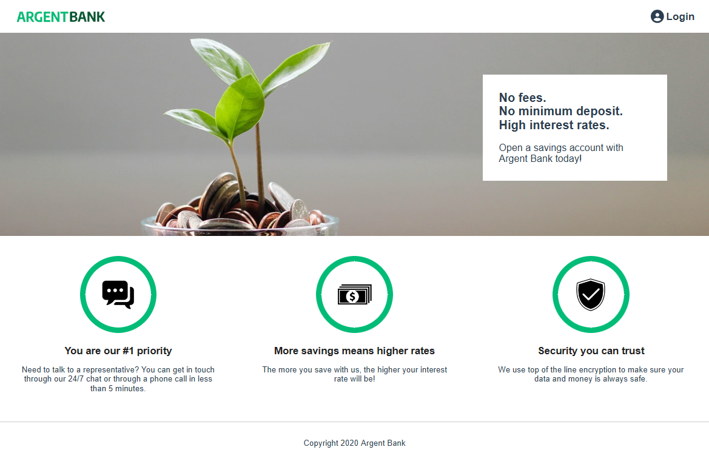

# ARGENT_BANK_FRONT-END



## Introduction

The **Argent Bank** front-end is a React-based web application that allows users to manage their bank accounts. It provides features such as secure authentication, account overview, and profile management, all with a modern and responsive interface.

## Table of Contents

1. [Installation](#installation)
2. [Getting Started](#getting-started)
3. [Project Structure](#project-structure)
4. [Features](#features)
5. [Technologies Used](#technologies-used)
6. [Contributing](#contributing)

## Installation

### 1. Prerequisites

Before getting started, ensure you have the following installed:

- **[NodeJS (version 14.17)](https://nodejs.org/en/)**

### 2. Install Dependencies

Once the repository is cloned, install all the necessary dependencies by running the following command:

```bash
npm install
```

### 3. Launch the Project

To start the development server and view the project locally, run the following command:

```bash
npm start
```

The application will be available at `http://localhost:3000`.

## Getting Started

After setting up the project, you can begin developing or exploring the application. The front end communicates with the back end via API calls, fetching data such as account balances and user profiles.

## Project Structure

Here’s an overview of the key directories and files:

```
|-- src/
    |-- assets/             # Static assets such as images
    |-- components/         # Reusable UI components
    |-- pages/              # Page components for routing
    |-- services/           # API services for data fetching
    |-- mocks/              # Mock data for testing and development
    |-- redux/              # Redux store, slices, and middleware
        |-- middleware/     # Custom Redux middleware
        |-- slice/          # Redux slices for state management
        |-- store.js        # Redux store configuration
    |-- App.js              # Main application component
    |-- index.js            # Entry point of the application
```

## Features

- **User Authentication**: Secure login and logout functionality
- **Account Overview**: View account balances and transaction details
- **Profile Management**: Update personal information
- **Responsive Design**: Fully responsive interface for desktop and mobile

## Technologies Used

- **React.js**: For building the user interface
- **Redux**: For state management across the application
- **React Router**: For handling navigation and routing
- **Fetch API**: For making HTTP requests to the back-end API
- **CSS Modules**: For modular and reusable CSS styling

## Contributing

Contributions are welcome! To contribute, follow these steps:

1. Fork the repository.
2. Create a new branch (`git checkout -b my-feature`).
3. Make your changes and commit them (`git commit -m 'Add my feature'`).
4. Push the branch (`git push origin my-feature`).
5. Open a Pull Request for review.

For any questions or suggestions, feel free to open an issue on GitHub.
